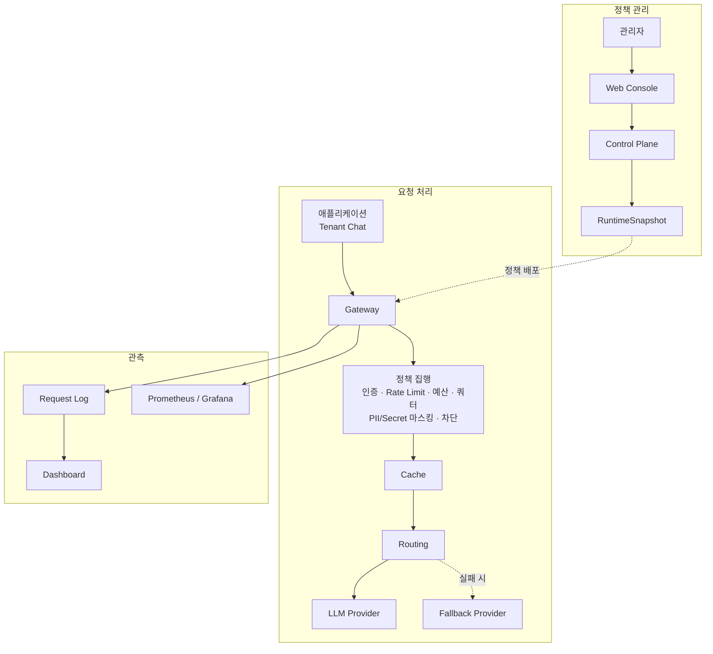

# GateLM

**기업의 LLM 트래픽을 한곳에서 통제하는 셀프 호스팅 LLM Gateway**

GateLM은 애플리케이션과 LLM Provider 사이에서 인증, 정책, 비용, 안전, 라우팅, 로그를 일관되게 관리합니다. 각 애플리케이션이 Provider별 연동과 운영 정책을 따로 구현하지 않아도 되도록 제어 영역과 요청 처리 경로를 분리해 제공합니다.

> GateLM은 현재 활발히 개발 중입니다. 코드가 존재하더라도 모든 기능이 GA 또는 릴리스 완료 상태를 의미하지는 않습니다. 정확한 범위는 [현재 구현 상태](docs/current/implementation-status.md)에서 확인해 주세요.

## 핵심 기능

- **중앙 관리**: Tenant, Project, Application, 직원 권한, Provider 연결, RuntimeSnapshot을 한곳에서 관리합니다.
- **요청 통제**: API 인증, Rate Limit, 예산·쿼터, PII·Secret 마스킹과 차단을 Provider 호출 전에 적용합니다.
- **지능형 실행**: Exact Cache, 선택적 Semantic Cache, category × difficulty 라우팅, Provider fallback을 지원합니다.
- **멀티 Provider**: OpenAI-compatible, Gemini-compatible, Anthropic Messages, 로컬 Mock Provider 어댑터를 제공합니다.
- **관측 가능성**: Request Log, Live Requests, 요청 상세, Dashboard, Prometheus·Grafana 연동을 제공합니다.
- **Tenant Chat**: 독립 인증·세션, private Gateway, 사용량 원장, Chat UI 구성요소를 포함합니다.
- **셀프 호스팅**: PostgreSQL과 Redis를 기반으로 한 Docker Compose 배포 구성을 제공합니다.

## 동작 구조



정책은 Control Plane에서 관리하고, 실제 LLM 요청에 대한 최종 집행은 Gateway에서 수행합니다.

## 기술 구성

| 경로 | 역할 | 주요 기술 |
|---|---|---|
| `apps/gateway-core` | 요청 처리와 정책 집행 | Go 1.24 |
| `apps/control-plane-api` | 관리 API와 RuntimeSnapshot 발행 | NestJS, Prisma |
| `apps/web` | 운영자용 Web Console과 Dashboard | Next.js 15, React 19 |
| `apps/chat-api`, `apps/chat-web` | Tenant Chat API와 사용자 화면 | NestJS, Next.js 15 |
| `apps/ai-service` | 선택적 AI Safety와 평가 서비스 | Python 3.12, FastAPI |
| `deploy/selfhost` | 단일 노드 셀프 호스팅 번들 | Docker Compose |
| `infra/observability` | 메트릭 수집과 시각화 | Prometheus, Grafana |

기본 개발 환경은 Node.js 22, pnpm 9.15.0, PostgreSQL 16, Redis 7을 사용합니다.

## 빠른 시작

다음 명령은 소스 개발에 필요한 의존성과 PostgreSQL, Redis, Mock Provider를 준비합니다.

```bash
git clone https://github.com/KYUJEONGLEE/GateLM.git
cd GateLM

# macOS / Linux
cp .env.example .env

corepack enable
pnpm install --frozen-lockfile
docker compose up -d postgres redis mock-provider
docker compose ps
```

Windows PowerShell에서는 환경 파일을 다음과 같이 복사합니다.

```powershell
Copy-Item .env.example .env
```

주요 개발 서버의 진입 명령은 다음과 같습니다.

```bash
pnpm dev:control-plane
pnpm dev:web
go run ./apps/gateway-core/cmd/gateway
```

Control Plane의 migration과 seed를 포함한 상세 절차는 [Control Plane 로컬 가이드](apps/control-plane-api/README.md)를 참고하세요. 전체 셀프 호스팅 구성은 [Self-host Compose 가이드](deploy/selfhost/README.md)에서 확인할 수 있습니다. 외부에 서비스를 노출하기 전에는 `.env`의 예시 Secret을 반드시 교체해야 합니다.

## 검증

문서와 저장소 계약을 검증합니다.

```bash
corepack pnpm run verify:v2-docs
corepack pnpm run verify:v2-final
```

변경 범위에 따라 애플리케이션과 Gateway 검증을 추가합니다.

```bash
pnpm --filter @gatelm/control-plane-api typecheck
pnpm --filter @gatelm/web typecheck
go test ./...
```

## 문서

- [현재 문서 진입점](docs/current/README.md): 작업 범위별로 어떤 문서를 읽어야 하는지 안내합니다.
- [문서 Source of Truth](docs/current/source-of-truth.md): 계약과 구현이 충돌할 때의 판단 기준입니다.
- [현재 구현 상태](docs/current/implementation-status.md): 구현된 기능과 제품 성숙도 경계를 정리합니다.
- [기술적 난제](docs/current/technical-challenges.md): 주요 설계 문제와 코드·테스트 근거를 설명합니다.
- [Gateway 라우팅 계약](docs/routing/README.md): category × difficulty 라우팅과 RuntimeSnapshot 계약입니다.
- [Tenant Chat](docs/tenant-chat/README.md): Tenant Chat의 계약, 스키마, 구현 범위를 설명합니다.
- [Self-host 운영 가이드](deploy/selfhost/README.md): 설치, migration, smoke test, 운영 문서로 연결합니다.

과거 버전 문서는 현재 작업의 기본 기준이 아닐 수 있습니다. 개발을 시작할 때는 항상 `docs/current`의 안내를 먼저 확인해 주세요.

## 기여하기

기본 개발 흐름은 최신 `dev`에서 작업 브랜치를 만들고, 검증 후 `dev` 대상 Pull Request를 여는 방식입니다.

1. 변경 범위와 관련 문서를 먼저 확인합니다.
2. 기능과 테스트를 함께 수정합니다.
3. 위 검증 명령 중 영향 범위에 해당하는 항목을 실행합니다.
4. API, DB, Event, Metrics, 보안 필드의 의미가 바뀌면 구현과 함께 계약 변경 근거를 제시합니다.

릴리스 정보는 [GitHub Releases](https://github.com/KYUJEONGLEE/GateLM/releases)에서 확인할 수 있습니다.

## 보안 원칙

- 실제 API Key, App Token, Provider Key, Authorization Header를 커밋하지 않습니다.
- raw prompt, raw response, raw detected value를 로그·메트릭·fixture·UI에 평문으로 남기지 않습니다.
- Provider 자격 증명은 서버 측 환경 변수 또는 승인된 Secret 관리 시스템에서 주입합니다.
- 운영 환경에서는 예시 Secret, 기본 비밀번호, 공개 포트, TLS 구성을 반드시 점검합니다.
