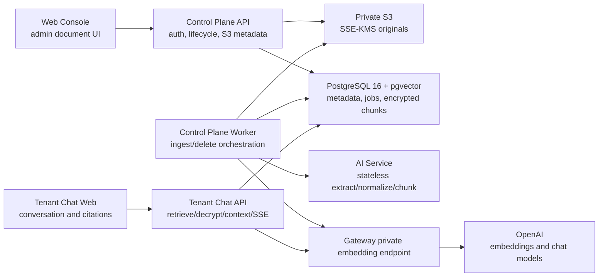
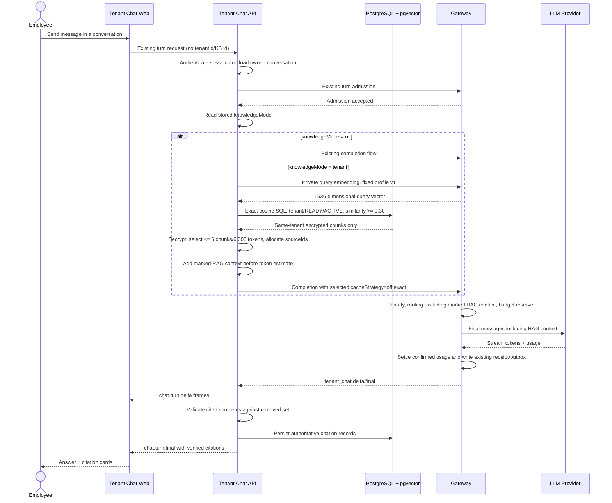

# Tenant Chat RAG MVP implementation plan

Status: **Approved MVP plan / implementation candidate through the RAG chat, citation, deletion, UI, and validation milestones / release blockers remain**

Current review baseline: `f3a67232ea` (`origin/dev`, verified 2026-07-17). The RAG candidate changes were reapplied on `feat/RAG-rc-sync` and revalidated against this baseline.

Current implementation progress: **The candidate contains the database, admin document API/UI, private object storage, extraction, embedding, durable worker, retrieval, RAG chat, encrypted citation, deletion, and validation slices described below. It is not release-ready: no tenant-admin Knowledge Base enable/disable API/UI exists, so a normally created Knowledge Base remains `DISABLED`, and the real staging S3/KMS/internal-service end-to-end smoke has not been executed.**

This document turns the agreed Tenant Chat RAG MVP boundary into repository-specific milestones. It is not an active API, database, event, or security contract. Contract-sensitive changes described here must first be promoted into the active Tenant Chat contract and reviewed in their own milestone.

Related decisions:

- [ADR-001: component ownership](adr-001-component-ownership.md)
- [ADR-002: embedding profile](adr-002-embedding-profile.md)
- [ADR-003: chunk and private document metadata encryption](adr-003-chunk-encryption.md)
- [ADR-004: cache policy](adr-004-cache-policy.md)
- [ADR-005: job processing](adr-005-job-processing.md)
- [ADR-006: citation protocol](adr-006-citation-protocol.md)
- [2026-07-17 release-candidate review](release-candidate-review.md)

## 1. Scope and invariants

### Product boundary

- RAG is exposed only through Tenant Chat.
- The public Gateway API and the existing Application Chat stay unchanged and do not receive RAG fields or routes.
- A tenant has exactly one Knowledge Base record. Each Document has at most one ACTIVE `RagDocumentIndex`.
- A Tenant Admin enables or disables the tenant RAG feature. Employees can choose RAG only while it is enabled.
- Only tenant administrators can upload, list, inspect, or delete documents.
- MVP sources are uploaded UTF-8 text files and PDFs with an extractable text layer.
- Scanned PDFs, image-only PDFs, OCR, external connectors, crawling, hybrid search, reranking, query rewriting, and agents are out of scope.
- Original uploads are stored in private S3 object storage. Metadata, encrypted chunks, vectors, and durable jobs are stored in PostgreSQL.
- Document deletion is an asynchronous hard delete. A delete request first makes the document unsearchable, then removes S3 and database data.
- Upload limits are fixed initially at 20 MB per file (implemented as `20 * 1024 * 1024` bytes), 300 PDF pages, and 500 existing document rows per tenant. Only TXT and text-layer PDF are accepted; empty extractable text is a terminal failure.

### Fixed embedding profile

- provider: `openai`
- model: `text-embedding-3-large`
- dimensions: `1536`
- distance: `cosine`
- profile version: `1`

This profile is not request-configurable. Any future profile change requires a new version, a new BUILDING `RagDocumentIndex` and full re-embedding for every affected Document, followed by per-Document atomic ACTIVE-index switches.

### Tenant and data safety invariants

- `tenantId` comes only from authenticated server context.
- Normal Tenant Chat requests never accept `tenantId` or `knowledgeBaseId` as a retrieval selector.
- Every Knowledge Base, index, document, chunk, job, and persisted citation row carries `tenantId`.
- Every vector SQL statement applies `tenantId` in SQL and joins tenant-scoped rows on both identity and `tenantId`.
- An application-layer post-filter is not an isolation control.
- Only chunks belonging to a READY document and that same Document's ACTIVE `RagDocumentIndex` are searchable.
- DELETING and FAILED documents are excluded immediately.
- Raw document text, raw chunk text, raw query text, embeddings, API keys, provider error bodies, and authorization material are never written to logs or metric labels.
- S3 bucket/key, vector values, similarity scores, and internal database IDs never appear in external responses.
- The externally visible `documentId` is a dedicated UUID, not a sequential ID or S3-derived value.
- Original filenames and citation display names are content. They are encrypted with the tenant AES-256-GCM key; only a normalized extension, MIME type, and byte size remain plaintext metadata.

### Who gets RAG

RAG is not automatically applied to every employee message. `TenantChatConversation` gains a server-persisted `knowledgeMode` with these values:

- `off` (default): current non-RAG flow.
- `tenant`: retrieve from the authenticated tenant's single active Knowledge Base.

The conversation create contract exposes only this mode and persists it server-side; turn requests cannot override it. It never exposes a Knowledge Base selector. The current Tenant Chat Web renders the choice, but it has no tenant Knowledge Base enablement read model yet; the missing tenant-admin enable/disable contract/API/UI must be completed before release so the choice is offered only for enabled tenants. On each turn the Chat API loads the stored conversation, authenticated tenant, and Knowledge Base status, then chooses the path.

- If mode is `off`, no retrieval or embedding call is made.
- If mode is `tenant` but the tenant feature is disabled, the turn fails with stable `CHAT_RAG_DISABLED`; it never silently switches to ordinary chat.
- If mode is `tenant` and there are no chunks at or above the approved relevance threshold, Chat API returns the deterministic no-evidence response without Gateway cache lookup, Provider completion, context, or citations.
- A query embedding, vector database, key lookup, decryption, Gateway, or AI Service availability failure returns stable `CHAT_RAG_UNAVAILABLE`; it never silently downgrades to ordinary chat.

### Approved chunking and retrieval profiles

`chunkingProfileVersion = 1`:

- target chunk size: 600 tokens;
- overlap: 100 tokens;
- maximum chunk size: 900 tokens;
- tokenizer name/version is frozen as part of chunking profile version 1 so token boundaries are reproducible;
- preserve PDF page identity;
- prefer paragraph and sentence boundaries and do not split them when the size limit can still be respected;
- deterministic normalization/tokenization for the same bytes and profile.

`retrievalProfileVersion = 1` initial values:

- maximum chunks included in context: 6;
- minimum cosine similarity: 0.30, defined as `similarity = 1 - cosine_distance` where pgvector cosine distance is produced by `<=>`;
- maximum RAG context: 6,000 tokens including the server-controlled source envelope;
- candidates below 0.30 are no-hit and never appear in context or citations;
- if more than six eligible chunks or more than 6,000 context tokens remain, remove the lowest-ranked complete chunks deterministically.

These are approved MVP initial values. Evaluation fixtures must validate them before production enablement. Pre-launch fixture tuning finalizes profile version 1; any production change increments `retrievalProfileVersion`, and chunk size/overlap changes also increment `chunkingProfileVersion` and require re-chunking/re-embedding.

### Environment and real-service policy

- Test: fake/mock/test doubles are allowed and are the default for external dependencies. Default test suites never call OpenAI, AWS, or deployed internal services.
- Explicit local development: fake/mock, MinIO/LocalStack, or other local test doubles are allowed only behind an explicit local-only configuration.
- Staging and production: fake/mock/local endpoints are forbidden. Startup validation fails fast if a fake adapter, mock provider, local object-store endpoint, or fake internal-service setting is present.
- Staging and production use real private S3, KMS, the Gateway private embedding endpoint, and the authenticated AI Service.
- Staging and production use separate private S3 buckets and separate KMS keys. Bucket/key identifiers remain internal configuration.
- AWS static access keys are forbidden in staging and production. Runtime configuration rejects explicit static credentials and uses workload IAM roles only.
- AI Service uses a separately provisioned service token per environment. Missing or explicitly local/fake tokens fail staging/production startup; deployment validation proves staging/production reference different secrets. Tokens are compared in constant time and never logged.
- PostgreSQL uses a pgvector-enabled PostgreSQL 16 image pinned by immutable version and digest in local integration, CI, staging, and production manifests.

## 2. Verified repository map

The workspace file is `pnpm-workspace.yaml` with `apps/*` and `packages/*` globs. The actual components are:

- Web Console: `apps/web` (`@gatelm/web`, Next.js 15 / React 19).
- Tenant Chat Web: `apps/chat-web` (`@gatelm/chat-web`, Next.js 15).
- Tenant Chat API: `apps/chat-api` (`@gatelm/chat-api`, NestJS).
- Control Plane API: `apps/control-plane-api` (`@gatelm/control-plane-api`, NestJS + Prisma).
- Gateway Core: `apps/gateway-core` (Go 1.24; not a pnpm package).
- AI Service: `apps/ai-service` (Python 3.12 + FastAPI; not a pnpm package).
- Existing Application Chat: `apps/application` (`@gatelm/application`), explicitly outside RAG scope.
- Mock Provider: `apps/mock-provider`, test/development support only.
- Generic worker scaffold: `apps/worker`; currently empty except scaffolding and not a runnable workspace package.
- Shared UI: `packages/ui` (`@gatelm/ui`).
- Web BFF helpers: `packages/web-bff` (`@gatelm/web-bff`).
- Tenant content crypto: `packages/tenant-content-crypto` (`@gatelm/tenant-content-crypto`), a built CommonJS package with framework-neutral AES-256-GCM/JCS/keyset/AAD contracts.
- RAG fixed configuration: `packages/rag-config` (`@gatelm/rag-config`), a built CommonJS package with the immutable embedding profile, global/tenant gate policy, and DB profile validator.
- `packages/shared` and `packages/contracts` are currently scaffolds, not importable packages.

### Component ownership after the MVP milestones



The Control Plane worker is a separate process built from the Control Plane codebase, not an in-process timer inside the HTTP API. The proposed entry point is `apps/control-plane-api/src/rag-worker.ts` with a narrow `RagWorkerModule`. It can reuse Prisma/config adapters while running as its own container/service. The empty generic `apps/worker` scaffold is not adopted for this MVP because doing so would duplicate the Control Plane's data/config/auth integration.

## 3. Current-state findings

### Prisma and PostgreSQL

- The authoritative Prisma schema is `apps/control-plane-api/prisma/schema.prisma`.
- The user-provided baseline said 34 migrations. The historical design baseline contained **37** migration directories. The three later migrations were:
  - `20260715180000_tenant_employee_cost_policies`
  - `20260715180100_tenant_employee_cost_policy_limit_constraints`
  - `20260715180200_tenant_employee_cost_ledger`
  The baseline count and list therefore must not be hard-coded into implementation prompts.
- Migration counts are historical evidence, not an invariant. The synchronized 2026-07-17 candidate contains 43 migrations and passes fresh-database validation, including the newer pre-RAG `20260716113000_tenant_chat_cache_outcome` migration before the additive RAG chain. CI derives the pre-RAG set by migration timestamp/name instead of a fixed count.
- Local, self-host, AWS-triage, distributed-performance, and CI manifests now use the same digest-pinned pgvector 0.8.5 PostgreSQL 16 image.
- The local database now has pgvector 0.8.5 installed by `CREATE EXTENSION IF NOT EXISTS vector`; the previous `postgres:16` image did not expose that extension.
- CI now has a dedicated PostgreSQL service/job that derives the pre-RAG baseline by migration name, runs the additive upgrade and fresh migration, and executes catalog/constraint integration tests. It deliberately does not hard-code a baseline count because unrelated earlier migrations continue to land on `dev`.
- The AWS deployment script runs `prisma migrate deploy` after starting the pinned compose PostgreSQL instance. Externally managed production extension privileges and copied-volume compatibility remain deployment prerequisites rather than repository-proven facts.

### Authentication and RBAC

- Control Plane admin routes use `AdminAuthGuard` and authenticated session cookies.
- The guard resolves the route tenant from server-owned resources and checks active tenant-admin membership / `TenantAdmin` scope.
- RAG admin endpoints belong under `/admin/v1/tenants/:tenantId/rag/...`, reuse the guard, and take the acting user from `CurrentAdminUserId`; a body `tenantId` is not accepted.
- The Web Console calls the Control Plane through server-side routes under `apps/web/src/app/api/control-plane`, forwarding the existing session cookie with helpers from `apps/web/src/lib/control-plane` and `packages/web-bff`.
- Tenant Chat authenticates the employee session in `apps/chat-api/src/auth/session.service.ts`. The resulting `AuthorizedExecution.tenantId` and stored conversation ownership are the only retrieval scope.

### Tenant Chat database and encryption

- Tenant Chat API accesses the same PostgreSQL database directly through `apps/chat-api/src/database/prisma.service.ts`.
- Messages and titles use AES-256-GCM in `apps/chat-api/src/content/content-crypto.ts` with a random 12-byte nonce, 16-byte authentication tag, a 32-byte data key, and canonical associated data.
- `TenantContentKeyService` manages per-tenant active key versions, grace/retired states, rollback floors, and wrapping-key rewraps using `tenant_chat_content_key_states` and `tenant_chat_content_keys`.
- The current AAD schema is chat-record-specific and cannot be reused unchanged for RAG chunks.
- `packages/tenant-content-crypto` owns deterministic crypto/JCS/keyset/AAD primitives while Chat API retains Nest/file/Prisma key-resolution adapters. Fixed legacy message fixtures prove existing ciphertext/AAD compatibility. The Control Plane document adapter and dedicated worker both use the same least-privilege wrapping-only key projection.
- `packages/rag-config` now validates the fixed OpenAI/1536/cosine/profile-v1 environment contract in Chat API and Control Plane. `TENANT_CHAT_RAG_ENABLED` defaults to `false`; both processes reject a mismatched Knowledge Base profile before listen regardless of the flag, while tenant enablement remains `RagKnowledgeBase.status=ENABLED`.

### Gateway, cache, budget, and usage

- The only OpenAI embedding client is currently under `apps/gateway-core/internal/domain/cache/semantic_openai_embedding.go`; it belongs to Semantic Cache and is not a private RAG API.
- The reusable HTTP/provider portion should later move behind a provider-neutral embedding interface. Semantic Cache and RAG then consume separate adapters/configuration without sharing cache policy or indices.
- Tenant Chat private Gateway routes already cover admission, cancellation, completion, and usage receipt with workload authentication.
- Tenant Chat completion performs validation, runtime snapshot lookup, safety, routing, exact-cache lookup when enabled, budget reservation, provider streaming, settlement, and usage outbox handling.
- `UsageIntent.cacheStrategy` already supports `off|exact`; RAG turns preserve that existing client selection after current retrieval and context construction. No additional client-controlled cache field is required.
- Semantic Cache belongs to the public Gateway handler and is not on the private Tenant Chat completion path. The RAG private route must remain unable to call it.
- Chat API calculates `EstimatedInputTokens` from the exact message list before calling Gateway; Gateway later settles from provider-confirmed usage. Retrieval context must be added before the estimate.
- Embedding usage does not currently enter the Tenant Chat budget ledger. For MVP it is approved platform operating cost: it never consumes employee/tenant chat budget, but safe usage metadata is persisted separately for operational cost measurement.

### Message construction and SSE

- The final Tenant Chat message list is assembled in `apps/chat-api/src/content/conversation.service.ts`, after admission and message persistence and before `internalUsageIntent` is calculated.
- Retrieval and context construction therefore belong after the ordinary history is assembled and before token estimation / Gateway completion.
- Gateway emits `tenant_chat.delta` and `tenant_chat.final` privately. Chat API maps these to browser events such as `chat.turn.accepted`, `chat.turn.delta`, and `chat.turn.final` in `conversation.controller.ts`.
- The strict browser parser is `apps/chat-web/src/lib/conversation-contract.mjs`; the current final event has no citation field.
- To prevent reference text from changing model routing classification, RAG context messages need an internal `purpose: "rag_context"` marker (default absent for existing messages). Gateway safety and provider input include the text, but routing classification excludes marked context. The provider adapter maps it to a system/reference block and strips the marker. This is a private contract change and must be reviewed before implementation.

### AI Service, object storage, and workers

- AI Service currently exposes internal-looking safety endpoints but has no route-level service-token authentication dependency. The RAG extraction route adds a distinct service token per environment before accepting document bytes; staging/production fail startup when the token is absent or local/fake.
- AI Service has no PDF parser dependency. The selected text-layer PDF library must support Python 3.12, deterministic page-level text extraction, encrypted/image-only detection, bounded in-memory parsing, maintained security fixes, a repository-compatible license, and tests without network/native subprocess requirements. It must not introduce OCR or execute embedded PDF content.
- M5 adds the Control Plane production S3 adapter under `apps/control-plane-api/src/modules/rag-documents/storage`, with managed streaming upload, explicit SSE-KMS, IAM-role-only production credential selection and safe compensation. `apps/worker/src/infrastructure/object-storage` remains only a scaffold and is not reused.
- No robust Redis queue/BullMQ implementation exists. There are PostgreSQL polling patterns using `FOR UPDATE SKIP LOCKED`, but they run for other concerns and are not a reusable RAG queue.
- The approved MVP job mechanism is a durable PostgreSQL `RagJob` table leased by a dedicated Control Plane worker process.

### Current verification entry points

- Documentation: `git diff --check`, `corepack pnpm run verify:v2-docs`.
- Shared RAG foundations: `corepack pnpm --filter @gatelm/tenant-content-crypto test|typecheck|build` and `corepack pnpm --filter @gatelm/rag-config test|typecheck|build`.
- Control Plane: `corepack pnpm --filter @gatelm/control-plane-api test|test:e2e|typecheck|build`.
- Tenant Chat API: `corepack pnpm --filter @gatelm/chat-api test|typecheck|build`.
- Tenant Chat Web: `corepack pnpm --filter @gatelm/chat-web test|lint|typecheck|build`.
- Web Console: `corepack pnpm --filter @gatelm/web test:unit|lint|typecheck|build`.
- Gateway: run `go test ./...` and `go vet ./...` from `apps/gateway-core`.
- AI Service: run `python -m unittest discover -s app/tests -p "test_*.py"` from `apps/ai-service`.
- Prisma: run `prisma format`, `prisma validate`, and `prisma migrate status` through the Control Plane package with an explicit `DATABASE_URL`.
- The root/package manifests have no repository-wide `format` script. Prisma has its own formatter; Markdown hygiene currently relies on the documented diff/docs checks unless a formatter is added in a separately approved tooling change.

## 4. Ingestion sequence

```mermaid
sequenceDiagram
    actor Admin as Tenant Admin
    participant Web as Web Console BFF
    participant CP as Control Plane API
    participant S3 as Private S3
    participant DB as PostgreSQL
    participant Worker as Control Plane Worker
    participant AI as AI Service
    participant GW as Gateway embedding API

    Admin->>Web: Upload .txt or text-layer .pdf
    Web->>CP: Admin session + tenant route + multipart upload
    CP->>CP: AdminAuthGuard, type/size/name validation
    CP->>DB: Create/load the tenant Knowledge Base
    CP->>S3: Stream original to opaque tenant/document key
    alt S3 upload fails or stream validation aborts
        CP-->>Web: Safe error; no Document or Job row
    else S3 object is durable
        CP->>DB: TX lock KB + limit/duplicate + Document UPLOADED + INGEST PENDING
        alt DB transaction fails or rejects
            CP->>S3: Best-effort compensation delete
            CP-->>Web: Safe error or duplicate conflict
        else DB transaction commits
            CP-->>Web: 202 + safe documentId + UPLOADED
        end
    end

    loop Lease bounded jobs
        Worker->>DB: SELECT ... FOR UPDATE SKIP LOCKED
        Worker->>DB: Mark RUNNING + lease
        Worker->>S3: Download original by internal key
        Worker->>AI: Authenticated extract/normalize/chunk bytes
        AI-->>Worker: Ordered text chunks + safe locators
        Worker->>GW: Authenticated batch embeddings, profile v1
        GW-->>Worker: 1536-dimensional vectors
        Worker->>Worker: Encrypt each chunk with tenant active key
        Worker->>DB: TX insert chunks + READY document + SUCCEEDED job
    end
```

Rules:

- The server may perform a non-authoritative tenant count preflight to avoid a wasteful upload. The authoritative tenant-scoped count and duplicate check occur in the post-S3 database transaction; they include DELETING rows until hard deletion completes and reject the 501st document.
- Upload streams with a 20 MB product limit implemented as `20 * 1024 * 1024` bytes; it is never buffered into logs or error payloads.
- AI extraction rejects PDFs above 300 pages and documents with empty extractable text as terminal failures.
- The S3 object key is opaque and generated by the server. The original filename is metadata, not part of the key.
- The original filename is normalized, length/control-character validated, and encrypted with the tenant key before database persistence. Only extension, MIME type, and byte size remain plaintext.
- S3 uses Block Public Access and SSE-KMS. Staging and production have separate buckets and KMS keys and authenticate only through workload IAM roles; static AWS credentials are rejected.
- AI Service is stateless, uses its environment-specific service token, never reads S3, and never persists document text.
- Gateway owns the OpenAI key. The worker never calls OpenAI directly.
- Worker batches are bounded by byte count, chunk count, embedding input count, and request timeout and use `chunkingProfileVersion = 1` (600 target tokens, 100-token overlap, 900-token maximum).
- A document becomes READY only in the same transaction that makes all expected chunks durable.

## 5. Retrieval and SSE sequence



No-hit and failure behavior:

- No result at cosine similarity 0.30 or above is a valid no-hit: send no RAG context, return an empty citation list and the deterministic local response, and do not call Gateway cache or Provider completion.
- Query embedding, vector database, key lookup, or decryption failure in `tenant` mode is a stable `CHAT_RAG_UNAVAILABLE` failure. Do not silently use ordinary chat because that changes the user's selected behavior.
- An unknown or hallucinated source marker is discarded and never becomes a citation.
- Cancellation follows the existing turn lifecycle and must cancel any admitted execution when retrieval fails before completion starts.

## 6. M2-confirmed database model

The database names below are fixed by migrations `20260716150000_rag_db_foundation` and `20260716153000_rag_db_foundation_invariants`. The second migration hardens lifecycle constraints without rewriting the already-applied foundation migration. All primary keys and tenant/resource relations use the repository's UUID and tenant-composite-FK conventions.

### `RagKnowledgeBase`

- `id`: internal UUID.
- `tenantId`: UUID, required, unique; enforces one Knowledge Base per tenant.
- `status`: `ENABLED | DISABLED`, changed only through Tenant Admin authorization.
- fixed profile columns: `embeddingProvider`, `embeddingModel`, `embeddingDimensions`, `embeddingDistance`, and `embeddingProfileVersion`.
- positive `revision` and timestamps.

### `RagDocumentIndex`

- `id`, `tenantId`, `documentId`.
- `version`: monotonically increasing per Document.
- `status`: `BUILDING | ACTIVE | RETIRED | FAILED`.
- parser/chunker version and the fixed provider/model/dimensions/profile version.
- unique `(tenantId, documentId, version)`.
- custom partial unique index `(tenantId, documentId) WHERE status = 'ACTIVE'` enforces one ACTIVE index version per Document. Prisma 6.19.3 cannot express this index, so the applied migration and catalog integration test are authoritative.

### `RagDocument`

- `id`: internal UUID.
- `publicId`: external safe UUID returned as `documentId`, globally unique.
- `tenantId`, `knowledgeBaseId`.
- `status`: `UPLOADING | UPLOADED | EXTRACTING | CHUNKING | EMBEDDING | INDEXING | READY | FAILED | DELETING`.
- encrypted private-metadata fields: ciphertext, nonce, tag, `contentKeyVersion`, and metadata crypto schema version. The payload contains normalized display name, content digest, and optional page count.
- allowed plaintext content metadata is limited to normalized extension, MIME type, and byte size. The plaintext original/display filename, content digest, and page count are never stored.
- `publicId` is the only safe UUID intended to become the external `documentId`; internal `id` and `s3ObjectKey` are never serialized externally.
- `uploadedByUserId`, safe `failureCode`, bounded sanitized failure message, and timestamps. Raw provider/library errors remain forbidden.

### `RagChunk`

- `id`, `tenantId`, `documentIndexId`, `documentId`.
- `ordinal`, `tokenCount` with the approved additive database hard bound of `1..900`, nullable paired page/line ranges, and bounded `sourceMetadata` JSON object. The separate 6,000-token value is the total retrieval-context cap, not a per-chunk allowance.
- AES-256-GCM fields: content ciphertext, nonce, auth tag, and `contentKeyVersion`.
- `embedding vector(1536)` represented by Prisma `Unsupported("vector(1536)")` and queried with parameterized SQL.
- bounded byte/token counts; no plaintext column.
- composite FK `(documentIndexId, documentId, tenantId)` prevents a chunk from mixing a different tenant, Document, or index.
- unique `(tenantId, documentIndexId, documentId, ordinal)`.

### `RagJob`

- `id`, `tenantId`, `knowledgeBaseId`, nullable `documentId`.
- `type`: `INGEST | DELETE | REINDEX`.
- `status`: `PENDING | RUNNING | RETRY_WAIT | SUCCEEDED | FAILED | CANCELLED`.
- `idempotencyKey`, attempts/max attempts, `availableAt`, lease owner/expiry, safe failure fields, deletion object-key snapshot, and timestamps. DELETE requires a snapshot from creation; INGEST/REINDEX forbid it. RUNNING requires a complete valid lease triple, while every non-RUNNING state requires all lease fields to be null.
- unique `(tenantId, type, idempotencyKey)`.
- The Document FK is `NO ACTION`. The admin delete transaction stores the server-owned opaque object-key snapshot on the DELETE job when that job is created. Before hard deletion, the worker transaction verifies/preserves that snapshot, cancels every non-terminal document job, and clears `documentId` on every job that references the Document. The Document can then be deleted while detached job history and tenant identity remain available without making `tenantId` nullable.

### Encrypted message citation snapshot

- Assistant message rows have nullable citation ciphertext, nonce, authentication tag, content-key version, and schema version fields.
- The bounded snapshot contains request-local `S1...Sn`, safe public document UUID, display name, page/line ranges, and chunk ordinal for sources actually cited in the answer.
- It has a distinct message-citation AAD and stores no internal index/chunk/job ID, excerpt, vector, score, object key, bucket, or raw source text.
- History decrypts only after tenant authorization and derives `available | unavailable` using a tenant-scoped READY-document lookup.
- Document hard deletion does not rewrite encrypted conversation history; it removes the active link target, so replay marks the historical citation unavailable.

### `RagEmbeddingUsage`

- `id`, `tenantId`, `purpose`: `INGESTION | QUERY`, embedding profile version, bounded input count/token count, provider-reported usage when available, platform-cost estimate, and timestamp.
- server-owned `operationId` and batch ordinal make retries idempotent; unique `(tenantId, purpose, operationId, batchOrdinal)`.
- does not write to or decrement the existing employee/tenant chat budget ledger.
- stores no input text, filename, document/chunk/query content, vector, provider raw response, or arbitrary error.

### `TenantChatConversation` extension

- `knowledgeMode`: `off | tenant`, default `off`.
- It does not store a client-selected Knowledge Base ID.
- `tenant` is effective only while the authenticated tenant Knowledge Base is ENABLED; disabled RAG fails explicitly rather than falling back.

### Exact vector query shape

The final SQL must be parameterized and structurally equivalent to:

```sql
SELECT c.id, c.document_id, c.content_ciphertext, c.content_nonce,
       c.content_auth_tag, c.content_key_version, c.ordinal,
       c.page_start, c.page_end, c.line_start, c.line_end
FROM rag_chunks AS c
JOIN rag_documents AS d
  ON d.id = c.document_id AND d.tenant_id = c.tenant_id
JOIN rag_document_indexes AS i
  ON i.id = c.document_index_id
 AND i.document_id = c.document_id
 AND i.tenant_id = c.tenant_id
JOIN rag_knowledge_bases AS kb
  ON kb.id = d.knowledge_base_id AND kb.tenant_id = c.tenant_id
WHERE c.tenant_id = $1::uuid
  AND d.tenant_id = $1::uuid
  AND i.tenant_id = $1::uuid
  AND kb.tenant_id = $1::uuid
  AND d.status = 'READY'
  AND i.status = 'ACTIVE'
  AND kb.status = 'ENABLED'
  AND (1 - (c.embedding <=> $2::vector)) >= $3::double precision
ORDER BY c.embedding <=> $2::vector
LIMIT $4;
```

For retrieval profile version 1, `$3 = 0.30` cosine similarity and `$4 = 6`; both are server-owned constants, never client parameters. MVP uses exact cosine distance. No HNSW or other approximate index is created. Evaluation fixtures must validate these approved initial values before production enablement.

## 7. API and internal contract drafts

The Knowledge Base enablement and document upload/list/status/delete shapes below are promoted into the active Tenant Chat contract by `docs/tenant-chat/openapi/admin-rag.openapi.json`. The private extraction/embedding, knowledge mode, RAG context, usage, retrieval errors, citation/SSE, and deletion contracts are also active in the linked Tenant Chat contract files.

### Control Plane admin API

- `GET /admin/v1/tenants/:tenantId/rag/knowledge-base`
  - Active: returns only `tenantEnabled`, read-only `globalEnabled`, and their AND `effectiveEnabled`. A missing singleton is reported as disabled without mutating on GET.
- `PATCH /admin/v1/tenants/:tenantId/rag/knowledge-base`
  - Active: Tenant Admin idempotently enables/disables employee RAG selection with exact `{enabled:boolean}`. It changes only Knowledge Base status; prepared documents, indexes, jobs, revision, and past citations are preserved.
- `GET /admin/v1/tenants/:tenantId/rag/documents`
  - Active M5 route. Cursor-paginated list with safe `documentId`, authorized server-decrypted display name, type, status, size, uploader, safe failure fields, and timestamps.
- `POST /admin/v1/tenants/:tenantId/rag/documents`
  - Active M5 route. Admin-authenticated streaming upload for `.txt`/`text/plain` and minimally signature-validated `.pdf`/`application/pdf`; `RAG_MAX_UPLOAD_BYTES` defaults to and cannot exceed 20 MiB, subject to the tenant 500-document limit.
  - Returns `202` only after the object is durable and the atomic `UPLOADED` Document plus `INGEST/PENDING` Job transaction commits.
- `GET /admin/v1/tenants/:tenantId/rag/documents/:documentId`
  - Active M5 route. Returns the same safe tenant-scoped document status resource and never resolves an internal DB ID.
- `DELETE /admin/v1/tenants/:tenantId/rag/documents/:documentId`
  - Active M6 route. Atomically marks the tenant-scoped Document `DELETING`, creates one `DELETE/PENDING` job with its opaque object-key snapshot, and returns `202`. Repeat while `DELETING` returns the same safe resource without a second job; after hard deletion the existing `404` absent-resource policy applies.

Every route uses `AdminAuthGuard`, the route tenant, and authenticated admin ID. DTOs reject unknown fields. No response exposes internal storage, key, vector, index, chunk, or job identifiers.

### AI Service extraction API

`POST /internal/v1/rag/extract`

- Authenticated by a dedicated per-environment internal service token using constant-time comparison; staging/production fail startup if it is missing or configured as local/fake.
- Request body is bounded raw `application/pdf` or `text/plain; charset=utf-8`; multipart is unnecessary between services.
- Response contains ordered normalized chunks: `ordinal`, `text`, exact tokenizer-derived `tokenCount`, `pageStart`/`pageEnd`, `lineStart`/`lineEnd`, bounded `sourceMetadata`, `parserVersion`, and `chunkerVersion`.
- TXT normalization is UTF-8 strict with BOM support, NUL removal, LF line endings, Unicode NFC, paragraph-preserving horizontal whitespace normalization, and 1-based line ranges.
- PDF parsing uses pinned `pypdf==6.14.2` in a killable child process. It reads only page text, preserves 1-based pages, and never follows images, attachments, scripts, or external references.
- Chunking uses pinned `tiktoken==0.13.0` and the official `text-embedding-3-large` mapping to `cl100k_base`; defaults are target 600, overlap 100, and hard maximum 900 tokens.
- Rejects encrypted PDFs, image-only/scanned PDFs, malformed UTF-8, unsupported types, files over 20 MB, PDFs over 300 pages, excessive chunks, and empty extractable text with stable codes.
- The PDF library must meet the approved Python 3.12, page-level deterministic extraction, bounded parsing, security maintenance, license, no-network/no-subprocess, and no-embedded-content-execution selection criteria.
- Has no S3, database, OpenAI, or persistent filesystem responsibility.

### Gateway embedding API

`POST /internal/v1/rag/embeddings`

- Private workload-authenticated route, unavailable from the public router.
- Request contains only a bounded array of text inputs, `purpose: RAG_INGESTION | RAG_QUERY`, and `profileVersion: 1`; tenant/provider/model/dimensions/credential/cache controls are not client-selectable.
- A dedicated RAG workload JWT reuses the private listener's Ed25519, JCS/HMAC request binding, and Redis JTI conventions without reusing the Chat admission/completion/cancel claims. The signing `kid` is atomically bound to issuer, subject, and allowed purposes: Chat API keys allow query and Control Plane Worker keys allow ingestion.
- Tenant identity is taken only from the verified RAG workload claim. The exact ordered request body is included in the signed binding, so input mutation or reordering fails before provider dispatch.
- Response preserves input order and contains only 1536-dimensional vectors, profile version, and bounded provider usage metadata needed for idempotent `RagEmbeddingUsage` recording.
- Gateway validates 1~128 inputs, a conservative 8,192-token upper bound per input, 300,000 per batch, bounded request/response bytes, response count/index order, finite numeric values, and vector dimensions.
- Provider attempts have a timeout and retry only bounded transient timeout/408/429/5xx/transport failures. Permanent 4xx, credential failures, invalid responses, and caller cancellation are not retried.
- Provider errors are mapped to stable internal codes without raw response bodies.
- Tests use fakes or `httptest`; default test suites never contact OpenAI. Custom endpoints require explicit `DEPLOYMENT_MODE=local|test`; an unclassified environment, staging, production, and self-host release register only the actual OpenAI adapter and fail startup on fake/mock configuration.
- Compose forwards the fixed Gateway RAG profile, credential reference, endpoint, and enablement flag so a production-like fake endpoint fails even while disabled. Dedicated caller signing/JWKS/HMAC/identity secret generation and mounts remain M6/M7; enabling RAG before those files are mounted intentionally fails Gateway startup instead of silently serving a disabled route.

M4 contract review keeps the existing signed `UsageIntent.cacheStrategy=off|exact` as the only RAG completion cache control. The private embedding route has no cache, and the private completion route is structurally disconnected from public Semantic Cache. Therefore duplicate client fields such as `cacheMode` or `semanticCache` are not added. Chat API performs current retrieval first and then preserves the existing strategy for Gateway Exact Response Cache evaluation.

### Tenant Chat private completion contract

- Existing turn requests add only conversation-level `knowledgeMode` through an active contract change.
- `knowledgeMode` defaults to `off`; `tenant` is accepted only when the authenticated tenant Knowledge Base is ENABLED by a Tenant Admin.
- Private ephemeral messages may carry `purpose: "rag_context"`; it is generated only by Chat API.
- Gateway workload signature covers that marker and its content.
- Safety sees the complete final input. Routing excludes RAG context. Provider adaptation includes it as reference context.
- `UsageIntent.cacheStrategy=off|exact` is preserved by Chat API after current retrieval and RAG context construction for every `tenant` turn.

### Browser SSE citation extension

`chat.turn.final` gains an optional `citations` array. Each entry contains only:

```json
{
  "sourceId": "S1",
  "availability": "available",
  "documentId": "safe-public-uuid",
  "displayName": "Employee handbook.pdf",
  "pageStart": 12,
  "pageEnd": 12,
  "lineStart": null,
  "lineEnd": null,
  "ordinal": 4
}
```

`displayName` and source locators are stored only inside the tenant-encrypted assistant citation snapshot and are decrypted only after tenant authorization.

After hard deletion, history returns the same encrypted historical metadata with `availability: "unavailable"`; Tenant Chat Web removes the link and renders the source as unavailable:

```json
{
  "sourceId": "S1",
  "documentId": "safe-public-uuid",
  "displayName": "Employee handbook.pdf",
  "pageStart": 12,
  "pageEnd": 12,
  "lineStart": null,
  "lineEnd": null,
  "ordinal": 4,
  "availability": "unavailable"
}
```

The exact JSON Schema, OpenAPI, fixture, strict parser, and replay/history behavior must be changed together. See ADR-006.

## 8. State transitions

### Document

```text
UPLOADED -> EXTRACTING -> CHUNKING -> EMBEDDING -> INDEXING -> READY
     |            |            |           |           |
     +------------+------------+-----------+-----------+-> FAILED

Any non-deleted state -> DELETING -> physically absent
```

- Only the worker advances extraction/embedding states.
- `UPLOADING` remains an additive M2 schema compatibility value, but the active M5 upload contract never writes it: S3 failure leaves no Document/Job and S3 success is finalized directly as `UPLOADED`.
- `FAILED` is not searchable and stores only a stable failure code.
- A delete request wins over an ingest attempt. Workers re-read state before each external side effect and stop ingestion if DELETING.
- Retrying a FAILED document is a new idempotent job / new index build decision, not an in-place accidental duplicate.

### Index

```text
BUILDING -> ACTIVE -> RETIRED
    |
    +-> FAILED
```

- Each successful ingestion creates a BUILDING `RagDocumentIndex` for one Document. A profile change or explicit REINDEX creates a new version for each affected Document.
- A single database transaction verifies all expected chunks, retires that Document's previous ACTIVE index, activates the complete replacement, and advances the Document to READY.
- The partial unique index guarantees that a Document cannot have two ACTIVE index versions, including during concurrent workers.
- Retrieval never queries BUILDING or RETIRED indices.

### Job

```text
PENDING -> RUNNING -> SUCCEEDED
              |
              +-> RETRY_WAIT -> RUNNING
              |
              +-> FAILED
              |
              +-> CANCELLED
```

- A lease timeout returns an abandoned RUNNING job to retry eligibility.
- Retryable failures use exponential backoff with jitter and bounded attempts.
- Unsupported or corrupt input is terminal; provider timeouts and transient S3/DB failures are retryable.
- A superseding delete may move an INGEST/REINDEX job from any non-terminal state (`PENDING`, `RUNNING`, or `RETRY_WAIT`) to CANCELLED; a RUNNING lease is cleared in the same transaction.

## 9. Transactions, retries, and idempotency

### Upload

1. After admin/tenant validation, the API creates or loads the tenant Knowledge Base, then generates internal and safe public Document UUIDs and an opaque object key. An S3 failure may leave this empty Knowledge Base, but never a Document or Job.
2. The API streams the validated bytes to S3 while calculating SHA-256. No `RagDocument` or `RagJob` exists yet; an S3 or stream-validation failure aborts the upload and returns a safe error without creating either row.
3. After S3 success, one tenant-scoped database transaction locks the resolved Knowledge Base, counts existing tenant documents, checks same-tenant encrypted digest duplicates, and inserts `RagDocument(UPLOADED)` plus one `RagJob(INGEST,PENDING)` with an opaque unique idempotency key. The count/duplicate result and both inserts commit atomically.
4. If this post-S3 transaction fails or rejects the request, the API attempts best-effort object deletion before returning the safe persistence error, document-limit error, or duplicate conflict. A compensation-delete failure emits a structured operation error without filename, display name, digest, bucket, object key, KMS key, or raw SDK error. Scheduled orphan reconciliation remains required before production because best-effort cleanup is not a guarantee.

### Ingestion

1. A short lease transaction claims jobs with `FOR UPDATE SKIP LOCKED`; no network call occurs while holding the lock.
2. Each stage re-checks `tenantId`, document state, job lease, profile, and the decrypted private-metadata digest.
3. Every ordinary ingestion or reindex writes only to a new BUILDING `RagDocumentIndex`; the completion transaction promotes it to ACTIVE after the full chunk set is durable.
4. The completion transaction verifies expected chunk count, inserts encrypted chunks/vectors (or promotes staged rows), marks the document READY, and marks the job SUCCEEDED.
5. Unique keys make replay harmless. A retried job either resumes a known stage or replaces only its own non-ACTIVE staged rows.

### Delete

1. The admin transaction locks the tenant-scoped document, changes it to DELETING, and inserts/deduplicates the DELETE job with the server-owned opaque `s3ObjectKey` snapshot already populated. SQL retrieval excludes the Document immediately.
2. The worker deletes the S3 object first; a missing object is success.
3. A database transaction verifies/preserves the DELETE job's existing opaque object-key snapshot, cancels non-terminal jobs, clears any associated leases, detaches every job that references the Document, finalizes the DELETE job, and then hard-deletes the Document. Indexes and chunks cascade; detached terminal/history jobs remain available under the retention policy. Existing encrypted conversation citation snapshots remain immutable; history resolves their tenant-scoped document availability and marks a deleted/non-READY source unavailable.
4. If the database step fails after S3 deletion, retry sees an absent object and completes the database deletion.

### Citation persistence

Citation snapshots are created only after Chat API validates source IDs against the exact retrieved set supplied to the provider. The bounded snapshot is encrypted with its own assistant-message AAD and committed atomically with the encrypted assistant response and final turn state. Raw context and chunk text are never stored in the conversation record.

## 10. Tenant isolation strategy

Tenant isolation is enforced at every boundary, not added after retrieval:

- Admin: session-authenticated `AdminAuthGuard` verifies route tenant scope.
- Chat: session authorization returns the tenant and user; conversation lookup includes both.
- Worker: each job lease returns `tenantId`; every subsequent object key, key lookup, document lookup, mutation, and vector insertion is re-scoped to it.
- S3: keys use server-owned tenant/document UUID prefixes, but key naming is defense in depth, not authorization. Staging/production buckets and KMS keys are environment-separated, IAM roles deny public access, and applications never accept an arbitrary object key or static AWS credential.
- Crypto: chunk AAD binds tenant, Knowledge Base, document, index, chunk, content kind, and key version; private-document-metadata AAD binds tenant, Knowledge Base, and document. Cross-tenant/cross-document substitution fails authentication.
- SQL: vector retrieval includes repeated tenant predicates on all joined tables.
- Internal APIs: environment-specific service tokens/workload authentication prove identity; `tenantId` sent between services is still validated against server-owned job/conversation state.
- Tests: two-tenant fixtures must prove that a closer vector in tenant B is never returned to tenant A and that cross-tenant document IDs produce the same safe not-found behavior.

## 11. Encryption boundary

- S3 originals: encrypted at rest with the environment's dedicated SSE-KMS key; plaintext exists only in bounded process memory while streaming/extracting.
- PostgreSQL chunk text: application-layer AES-256-GCM with the current tenant content-key hierarchy.
- PostgreSQL private document metadata: display name, content digest, and page count use application-layer AES-256-GCM with a distinct metadata AAD/content kind. Only extension, MIME type, and byte size are allowed plaintext content metadata.
- Vectors: plaintext `vector(1536)` because PostgreSQL must calculate cosine distance. Treat embeddings as sensitive derived data and tenant-scope all access/backups.
- Query text: sent to the private Gateway embedding endpoint and then OpenAI under the configured provider policy; never persisted or logged by RAG code.
- Decrypted chunks: exist only in Tenant Chat API memory long enough to construct a bounded context; zero or release buffers/references as soon as practical.
- Citation responses decrypt the assistant message's separately encrypted snapshot only after tenant authorization. No plaintext citation snapshot is stored in relational metadata, logs, metrics, or caches.

The new `RagChunkAadV1` is detailed in ADR-003. Existing chat ciphertext and AAD must not be rewritten as a side effect of extracting shared primitives.

## 12. Cache, token, and budget handling

- `knowledgeMode=tenant` always performs query embedding and current tenant retrieval before any response-cache lookup.
- When `cacheStrategy=exact` and Runtime Snapshot cache policy enables Exact Cache, Gateway fingerprints the complete final Provider input, including current RAG context and conversation history, inside the existing `tenantId + userId` namespace. A hit skips only Provider completion.
- When `cacheStrategy=off`, Gateway skips Exact Cache exactly as it does for non-RAG Tenant Chat.
- Public Semantic Cache is outside the private Tenant Chat route and stays outside it.
- There is no vector-result cache, query embedding cache, or decrypted-context cache. The existing encrypted Exact Response Cache is the only RAG response cache.
- Retrieval context includes at most six chunks with cosine similarity at least 0.30 and is bounded to 6,000 tokens before it is appended.
- Chat API computes `EstimatedInputTokens` only after the marked RAG context is included in the final messages.
- Gateway uses that estimate for reservation, applies provider limits to the final input, and settles with provider-confirmed usage exactly as the current Tenant Chat flow does.
- If final context exceeds limits, Chat API deterministically drops the lowest-ranked complete chunks before admission/completion; it does not truncate encrypted/plain text at arbitrary bytes.
- MVP embedding cost is platform operating cost and never decrements employee/tenant chat budget. `RagEmbeddingUsage` records bounded, idempotent operational usage without raw content so cost can be measured separately.

## 13. Milestones

Each milestone should be a separately reviewable PR. File lists are expected scope and may be narrowed after contract review; files not listed are out of scope unless the PR explains why.

### M0 — Active contracts and fixtures

Goal: promote the selected RAG shapes into active Tenant Chat contracts before production code.

Expected files:

- `docs/tenant-chat/README.md`
- `docs/tenant-chat/contracts.md`
- applicable schemas, OpenAPI, and fixtures under `docs/tenant-chat`
- `docs/current/README.md` only if the scope router must link a newly active contract

Must not change: Prisma schema, application source, compose/deploy files.

Validation:

```powershell
git diff --check
corepack pnpm run verify:v2-docs
corepack pnpm --filter @gatelm/chat-web test
```

### M1 — Crypto compatibility and fixed-profile configuration

Goal: extract crypto primitives without changing existing Tenant Chat ciphertext behavior, add distinct RAG chunk/document-private-metadata AAD builders, and make the fixed embedding profile/default-off feature gate reusable by the current TypeScript services and future Control Plane worker.

Implementation status: **implemented in the current `feat/RAG` worktree; no worker or RAG data path was added**.

Expected files:

- new `packages/tenant-content-crypto/package.json`, `src/*`, and tests
- new `packages/rag-config/package.json`, `src/*`, and tests
- `pnpm-lock.yaml`, `pnpm-workspace.yaml` only if required by the established workspace pattern
- narrow imports/tests in `apps/chat-api/src/content/*`
- fixed-profile env validation and startup guards in Chat API and Control Plane
- backend package build/runtime wiring in the two API Dockerfiles and CI

Must not change: database schema, key-state tables, message AAD bytes, APIs.

Validation:

```powershell
corepack pnpm --filter @gatelm/tenant-content-crypto test
corepack pnpm --filter @gatelm/tenant-content-crypto typecheck
corepack pnpm --filter @gatelm/tenant-content-crypto build
corepack pnpm --filter @gatelm/rag-config test
corepack pnpm --filter @gatelm/rag-config typecheck
corepack pnpm --filter @gatelm/rag-config build
corepack pnpm --filter @gatelm/chat-api test
corepack pnpm --filter @gatelm/chat-api typecheck
corepack pnpm --filter @gatelm/chat-api build
corepack pnpm --filter @gatelm/control-plane-api test
corepack pnpm --filter @gatelm/control-plane-api typecheck
corepack pnpm --filter @gatelm/control-plane-api build
```

Compatibility fixtures must prove existing chat AAD/ciphertext bytes remain unchanged and new private-metadata AAD fails on tenant/Knowledge Base/document/key substitution.

### M2 — pgvector-capable database and RAG schema

Goal: select a pgvector-enabled PostgreSQL 16 artifact, pin both version and immutable digest across every current repo-managed PostgreSQL path, add the extension/migration, and add tenant-scoped RAG models only. Any future dedicated staging manifest must reuse the same approved pin until an explicit upgrade milestone changes it.

Implementation status: **implemented in the current `feat/RAG` worktree**.

Pinned artifact:

```text
pgvector/pgvector:0.8.5-pg16-trixie@sha256:073acab878025cadf03fe6fed01babaaa285b8d09ddc9c43882cf02d409546d7
```

The digest is the multi-architecture OCI index. The verified local `linux/amd64` runtime is PostgreSQL 16.14 with pgvector 0.8.5. Local, self-host, AWS triage, distributed performance, and CI manifests use the identical immutable reference.

Expected files:

- `apps/control-plane-api/prisma/schema.prisma`
- one or more new directories under `apps/control-plane-api/prisma/migrations`
- root `docker-compose.yml` plus relevant files under `deploy/selfhost` and `deploy/aws-triage`
- `.github/workflows/ci.yml` database migration job/fixture
- Prisma repository/migration tests only

Must not change: HTTP routes, upload UI, OpenAI calls, retrieval flow.

Validation:

```powershell
corepack pnpm --filter @gatelm/control-plane-api exec prisma format --schema prisma/schema.prisma
corepack pnpm --filter @gatelm/control-plane-api exec prisma validate --schema prisma/schema.prisma
corepack pnpm --filter @gatelm/control-plane-api exec prisma migrate status --schema prisma/schema.prisma
corepack pnpm --filter @gatelm/control-plane-api test
corepack pnpm --filter @gatelm/control-plane-api typecheck
corepack pnpm --filter @gatelm/control-plane-api build
```

Migration acceptance includes a fresh database, an upgrade from the current 37-migration schema, image-digest verification, `vector(1536)` dimension enforcement, tenant foreign keys, unique one-KB constraint, and rollback/backup documentation. Never edit an already-applied migration.

Migration and drift authority:

- `schema.prisma` represents `vector(1536)` as `Unsupported("vector(1536)")`; subsequent vector writes and searches remain parameterized raw SQL.
- Prisma 6.19.3 cannot represent the partial ACTIVE index or every custom CHECK constraint. Migrations `20260716150000_rag_db_foundation` and `20260716153000_rag_db_foundation_invariants` are authoritative for those objects.
- `prisma migrate status`, fresh and 37→39 `migrate deploy`, a Prisma diff assertion limited to M2-owned table names, the migration static spec, and the `pg_catalog` integration spec together form the scoped drift guard.
- A whole-database `migrate diff --from-url ... --to-schema-datamodel ...` is not an M2 completion gate because the current local database already contains separately owned Gateway raw-SQL objects and historical name/default differences. Fixing those unrelated pre-existing differences is outside this milestone.

Production installation and rollback boundary:

- The repo-managed deployment starts the pinned PostgreSQL image before `prisma migrate deploy`; the migration's `CREATE EXTENSION IF NOT EXISTS vector` is the single extension-install owner.
- The compose-created PostgreSQL role can install the extension. An externally managed PostgreSQL target must have the pgvector extension files and `CREATE EXTENSION` privilege pre-provisioned and verified before deployment.
- This is a same-major PostgreSQL 16 image switch and an additive schema migration. Take and verify a `pg_dump` before the image switch and validate a restored/copy volume in staging first.
- Current automated deployment rollback protects application images only; it does not restore the former PostgreSQL image or reverse database migrations. Application rollback may leave the pinned pgvector image, unused RAG tables, and extension in place. Destructive schema or PostgreSQL-image rollback requires a separately reviewed operation after confirming backup integrity, volume compatibility, and that no RAG data or dependent vector objects exist; never rewrite or remove either applied M2 migration directory.

### M3 — AI extraction service

Goal: add authenticated stateless TXT/text-layer-PDF extraction and chunking.

Expected files:

- `apps/ai-service/app/*` route/auth/extraction modules
- `apps/ai-service/app/tests/*`
- `apps/ai-service/pyproject.toml` and `requirements-rag-extraction.lock`
- AI Service configuration documentation

Must not change: S3, database, OpenAI, OCR, public endpoints.

Validation:

```powershell
Push-Location apps/ai-service
python -m unittest discover -s app/tests -p "test_*.py"
python -m compileall app
Pop-Location
```

The PDF dependency must satisfy the approved Python 3.12, deterministic page extraction, encrypted/image-only detection, bounded parsing, active security maintenance, compatible license, no-network/no-subprocess, and no-embedded-content-execution criteria. `pypdf==6.14.2` satisfies the selected pure-Python/page-text boundary; GateLM contains it in a killable process and does not access embedded content. Fixtures must cover UTF-8 text, text PDF pages, scanned/image-only rejection, encrypted PDF rejection, malformed input, 20 MB/300-page/chunk limits, per-environment service-token auth failure, and log redaction.

### M4 — Gateway private embedding endpoint

Goal: create the fixed-profile private batch embedding service and separate provider code from Semantic Cache ownership.

Expected files:

- `apps/gateway-core/internal/adapters/embeddings/*`
- `apps/gateway-core/internal/domain/embedding/*`
- `apps/gateway-core/internal/http/tenantchat/*` or a dedicated internal RAG router
- Gateway config/schema/tests
- minimal semantic-cache adapter imports required by the refactor

Must not change: public Gateway API, public Semantic Cache behavior/index, routing policy, provider selection contract.

Validation:

```powershell
Push-Location apps/gateway-core
go test ./...
go vet ./...
Pop-Location
```

Tests use fakes/`httptest` only and assert auth, limits, order preservation, dimension 1536, provider error redaction, and public-route absence. Staging/production startup tests prove that fake adapters are rejected and the actual provider adapter is selected.

### M5 — Control Plane S3 admin upload/read lifecycle

Goal: add admin-only upload/list/single-status lifecycle, a real IAM-role S3/KMS runtime adapter, and a fake-tested storage port; no ingestion execution yet.

Expected files:

- `apps/control-plane-api/src/modules/rag-documents/*`
- `packages/tenant-content-crypto/src/keyset.ts` and types/tests for the additive wrapping-only projection
- Control Plane configuration/env validation
- admin controller/service/repository/object-store tests
- deployment Compose/secret wiring and the local wrapping-key projection helper
- `docs/tenant-chat/openapi/admin-rag.openapi.json` and the paired active contract text
- approved AWS SDK dependency and lockfile

Must not change: Knowledge Base enable/disable API, document delete API, parser/chunk/embedding execution, Chat API, Gateway completion, AI extraction, Web UI, citation UI.

Validation:

```powershell
corepack pnpm --filter @gatelm/control-plane-api test
corepack pnpm --filter @gatelm/control-plane-api test:e2e
corepack pnpm --filter @gatelm/control-plane-api typecheck
corepack pnpm --filter @gatelm/control-plane-api build
```

Unit/integration tests use a fake object store/local test double, not real AWS. They cover admin/non-admin and tenant scope, TXT/PDF upload, MIME/signature/name traversal, empty/size errors, same-tenant duplicate conflict, S3 failure, atomic Document/Job creation, post-S3 database failure compensation, list/status isolation, and response-field allowlisting. Runtime configuration tests prove staging/production require private bucket/KMS configuration, reject static AWS credentials and fake/local endpoints, and select the actual IAM-role S3/KMS adapter.

The production adapter never uses the AWS SDK default credential chain: ECS task credentials, IRSA/web identity, or EC2 instance metadata are the only allowed sources. Control Plane receives only `RAG_CONTENT_WRAPPING_KEYS_FILE`, an exact wrapping-only projection that excludes Tenant Chat `integrityKey`; startup in S3 mode validates file readability, rollback floor, and all non-retired DEK wrapping versions before listen. Multipart total bytes and idle time are bounded in addition to the configured file limit. Database finalization uses predetermined IDs and an idempotent retry under the tenant Knowledge Base lock when COMMIT acknowledgement is ambiguous.

### M6 — Dedicated ingestion/deletion worker

Goal: run the approved PostgreSQL `RagJob` worker, call extraction/embedding, encrypt filenames/chunks, record platform embedding usage, and complete hard deletion. Encrypted citation snapshot persistence is implemented in M8 and remains independent from the delete transaction.

Implementation status: **INGEST and DELETE orchestration are implemented in the current worktree.** The dedicated process leases both job types; DELETE first performs idempotent S3 deletion from the durable snapshot, then atomically cancels/detaches conflicting jobs and hard-deletes the Document with cascading indexes/chunks. Existing encrypted conversation citations are not part of this transaction and become unavailable on replay.

Expected files:

- `apps/control-plane-api/src/rag-worker.ts`
- `apps/control-plane-api/src/rag-worker/*`
- shared RAG repositories/adapters in `apps/control-plane-api/src/rag/*`
- worker command in `apps/control-plane-api/package.json`
- compose service definitions and deployment script changes
- worker unit/integration tests

Must not change: Chat retrieval, SSE, Web UI.

Validation:

```powershell
corepack pnpm --filter @gatelm/control-plane-api test
corepack pnpm --filter @gatelm/control-plane-api test:e2e
corepack pnpm --filter @gatelm/control-plane-api typecheck
corepack pnpm --filter @gatelm/control-plane-api build
docker compose config
docker compose --env-file deploy/selfhost/.env.example -f deploy/selfhost/docker-compose.yml config
docker compose --env-file deploy/aws-triage/.env.example -f deploy/aws-triage/docker-compose.yml config
```

Integration fixtures prove lease recovery, retry backoff, duplicate delivery idempotency, delete-during-ingest, S3-success/DB-failure recovery, 20 MB/300-page/500-document limits, 600/100/900 chunking, idempotent embedding usage, hard deletion cascade, and no plaintext filename/chunk persistence or logging. Encrypted citation replay fixtures belong to M8.

### M7 — Tenant Chat retrieval, context, and cache/budget behavior

Goal: add Tenant Admin enablement, default-off conversation knowledge mode, exact tenant-scoped retrieval, decryption, marked context, approved retrieval profile, and fail-closed RAG semantics.

Expected files:

- `apps/chat-api/src/content/*`
- new `apps/chat-api/src/rag/*`
- Chat API Gateway client/private contracts and tests
- Control Plane Prisma migration for `knowledgeMode` if not included in M2
- minimal Gateway private completion changes for `purpose: rag_context`

Must not change: public Gateway/Application Chat APIs, Web Console document UI, citation rendering.

Validation:

```powershell
corepack pnpm --filter @gatelm/chat-api test
corepack pnpm --filter @gatelm/chat-api typecheck
corepack pnpm --filter @gatelm/chat-api build
Push-Location apps/gateway-core
go test ./...
Pop-Location
```

Integration tests use two tenants and prove SQL isolation, READY/ACTIVE/ENABLED filtering, mode default `off`, `CHAT_RAG_DISABLED`, `CHAT_RAG_UNAVAILABLE` without ordinary-chat fallback, no-hit below 0.30, top six, 6,000-token context, preserved `off|exact`, same-user exact-cache reuse, cross-user/cross-tenant isolation, context-change miss, final-input token estimate, admission cancellation, key versions, platform-only embedding usage, and context exclusion from routing classification.

### M8 — Citation protocol and Tenant Chat UI

Goal: persist server-verified citations in the encrypted assistant record, extend SSE/history contracts, render citation cards, and render deleted/non-READY sources as unavailable without a link.

Expected files:

- active Tenant Chat schemas/OpenAPI/fixtures
- `apps/chat-api/src/content/*` and `src/rag/*`
- `apps/chat-web/src/lib/conversation-contract.mjs`
- `apps/chat-web/src/components/chat-shell.tsx` and focused citation components/tests

Must not change: ingestion, public Gateway/Application Chat.

Validation:

```powershell
corepack pnpm --filter @gatelm/chat-api test
corepack pnpm --filter @gatelm/chat-api typecheck
corepack pnpm --filter @gatelm/chat-web test
corepack pnpm --filter @gatelm/chat-web lint
corepack pnpm --filter @gatelm/chat-web typecheck
corepack pnpm --filter @gatelm/chat-web build
```

### M9 — Web Console document UI and production readiness

Goal: deliver tenant-admin upload/list/status/delete UX and validate the complete deployment path.

Expected files:

- `apps/web/src/app/*` existing tenant-admin route tree
- `apps/web/src/app/api/control-plane/*`
- `apps/web/src/lib/control-plane/*`
- `deploy/*`, `.github/workflows/ci.yml`, runbooks and RAG operational docs

Must not change: public Gateway/Application Chat contracts, MVP retrieval algorithm.

Validation:

```powershell
corepack pnpm --filter @gatelm/web test:unit
corepack pnpm --filter @gatelm/web lint
corepack pnpm --filter @gatelm/web typecheck
corepack pnpm --filter @gatelm/web build
corepack pnpm run verify:v2-final
```

Acceptance includes admin/non-admin authorization, two-tenant isolation, upload limits, eventual status, idempotent hard delete, environment-separated private S3/KMS, IAM-role-only access, static-key rejection, pgvector version/digest and migration on a production-like clone, per-environment AI Service tokens, worker health/lag, no-secret logs, citation replay/tombstones, post-retrieval same-user Exact Response Cache with explicit cache-off regression, platform embedding usage, budget accuracy, backup/restore, and rollback. Staging/production startup must fail on every fake/mock/local endpoint setting and must exercise the actual S3, KMS, Gateway embedding, and AI Service boundaries in a controlled deployment smoke test.

## 14. MVP non-goals

- OCR, scanned/image PDF, image extraction, tables-as-structure, or layout reconstruction.
- Download/replacement/versioning of original documents through the UI.
- Google Drive, Notion, Confluence, SharePoint, Box, web crawling, or arbitrary URLs.
- Non-Tenant-Chat consumers, public RAG API, Application Chat, or public Gateway RAG fields.
- Multiple Knowledge Bases per tenant or per-user Knowledge Bases.
- Per-message client-selected Knowledge Base.
- Hybrid lexical/vector search, HNSW, reranker, query rewriting, multi-query, agent/tool retrieval, feedback learning.
- Cross-tenant/global knowledge, document sharing, or federated search.
- OCR/provider fallbacks on extraction failure.
- Real external OpenAI/S3/internal-service calls in the default unit/integration suites.

## 15. Implementation prerequisites still open

The product directions in this plan are approved. The remaining items are concrete implementation/deployment prerequisites, not product-choice blockers:

1. **pgvector deployment evidence:** the PostgreSQL 16 + pgvector 0.8.5 artifact and digest are fixed and local fresh/upgrade tests pass. A production-like restored-volume rehearsal and extension privilege check remain required for every externally managed staging/production database.
2. **S3/KMS/IAM provisioning:** the Control Plane adapter and fail-closed runtime selection exist after M5; still create or identify separate staging/production private buckets and KMS keys, lifecycle/VPC policies, and workload IAM roles, and verify them in each deployed environment. MVP buckets must keep versioning disabled/suspended until version-aware hard deletion is implemented and tested.
3. **AI token operations:** define environment-specific secret storage, delivery, rotation, grace, and revocation for the extraction service token.
4. **Dependencies:** the M5 AWS SDK packages and M3 `pypdf==6.14.2`/`tiktoken==0.13.0` packages are approved and locked. Local tests and the AI Service image install the lock successfully; the synchronized candidate still requires its own official Linux CI run before image promotion.
5. **Chunk constraint reconciliation:** resolved by additive migration `20260716200000_rag_worker_foundation`, which replaces only `rag_chunks_counts_check` with the approved 900-token maximum before worker persistence. The applied M2 migration remains immutable.
6. **Evaluation evidence:** validate the approved initial 600/100/900 chunking and top-six/0.30/6,000-token retrieval profile with fixtures before production enablement; tune version 1 only before launch.
7. **Tenant enablement deployment evidence:** the reviewed Tenant Admin Knowledge Base contract, Control Plane API, and Web Console flow are implemented. The remaining release evidence is the official CI/browser flow plus staging verification that disable blocks the next retrieval and re-enable reuses an existing READY index without re-ingestion.
8. **Operational policy:** set worker concurrency, lease duration, retry limits, SLOs, backup/restore, orphan reconciliation cadence, and alarm thresholds. PostgreSQL `RagJob` itself is already the approved MVP mechanism.

## 16. Decisions changed from the initial assumptions

- The requested 34-migration assumption was stale: the historical verified baseline had **37**. M2 added two immutable, additive RAG migrations without editing prior history; their ordinal numbers can shift when `dev` receives an earlier-timestamp migration, so migration names and ordering—not a hard-coded total—are authoritative.
- Not every employee chat uses RAG. A persisted conversation-level `knowledgeMode`, default `off`, distinguishes ordinary and RAG conversations without accepting a Knowledge Base ID.
- Tenant Admin enablement gates employee access; disabled or unavailable RAG fails explicitly and never silently falls back to ordinary chat.
- Original filenames and citation snapshots are tenant-key encrypted. Hard deletion removes the knowledge document/index/chunks/vectors but leaves past encrypted conversation records; history marks their citations unavailable so the UI can show `삭제된 자료 또는 현재 사용할 수 없는 출처` without a link.
- MVP limits are approved at 20 MB, 300 PDF pages, 500 tenant documents, 600-token target chunks with 100 overlap and 900 maximum, top six results at cosine similarity 0.30 or above, and 6,000 RAG-context tokens.
- Embedding cost is platform operating cost for MVP and is recorded separately without decrementing employee/tenant chat budget.
- The worker is a separate Control Plane process from the existing Control Plane codebase. The empty `apps/worker` scaffold is not used because it has no package/runtime and would duplicate ownership.
- The existing Semantic Cache embedding file is not reused as the RAG service boundary. Only its provider HTTP logic is refactored behind a neutral adapter; RAG has a private fixed-profile endpoint and separate configuration.
- The former `postgres:16` image could not run pgvector. M2 replaces each active reference with the same immutable `pgvector/pgvector:0.8.5-pg16-trixie` digest before applying the vector migration.
- AI Service extraction is authenticated raw-body internal HTTP, not direct S3 access or multipart between services. This keeps it stateless and avoids a second storage principal.
- Staging/production use environment-separated real S3/KMS, IAM roles, actual Gateway/AI Service boundaries, and environment-specific AI tokens; fake/mock/static-key/local settings fail startup.
- RAG context receives an internal `rag_context` purpose marker so it is included in safety/provider token accounting but excluded from routing classification.
- A deletion request is logically immediate but physically asynchronous: DELETING excludes the document from SQL first, then the worker performs the requested hard delete idempotently.

## 17. M2 completion criteria

- The four active PostgreSQL Compose references and the CI service use the same pgvector PostgreSQL 16 tag and immutable digest.
- The full 39-migration chain applies to an empty database, and migrations 38–39 apply after the prior 37 migrations without mutating existing application data.
- The extension, `vector(1536)`, one-Knowledge-Base rule, Knowledge Base deletion RESTRICT, composite tenant FKs, one-ACTIVE-index rule, 800-token chunk bound, job snapshot/lease shapes, and Document cascade behavior are verified in a real PostgreSQL integration test.
- DELETE and terminalized INGEST/REINDEX jobs survive Document hard deletion after the required creation-time DELETE snapshot and worker-transaction cancellation, lease clearing, and all-job detachment protocol.
- Filename/display name/content digest have no plaintext columns; private metadata and chunks reference tenant content-key versions.
- Prisma format, validate, generate, migration status, focused unit/integration tests, typecheck, build, Compose validation, documentation checks, and final diff review pass.
- HTTP routes, S3/parser/embedding calls, worker execution, Tenant Chat retrieval/SSE, and user interfaces remain unchanged.

## Appendix A. Verified migration inventory

The 37 directories present at repository baseline `6a43b757...` plus the two additive M2 migrations are:

```text
20260627060000_control_plane_init
20260630090000_runtime_snapshot_persistence
20260702030000_provider_presets
20260703090000_team_management
20260703100000_project_application_budgets
20260703102000_application_local_app_key
20260704001000_drop_application_local_application_key
20260704115000_application_provider_connections
20260705120000_auth_onboarding
20260705120000_tenant_project_app_budget_contract
20260705143000_chat_conversations
20260705153000_budget_usage_ledger
20260706093000_budget_operations
20260706120000_provider_credential_store
20260707090000_project_admin_invitations
20260707120000_resource_status_draft
20260707130000_project_admin_invitation_name
20260708093000_openai_flagship_pricing_catalog
20260708101000_openai_gpt_pricing_catalog_expansion
20260708102000_openai_provider_config_model_merge
20260709100000_employee_control_pr1
20260710110000_employee_invitation_and_org_import
20260710123000_remove_employee_job_title
20260712190000_tenant_chat_runtime_usage_pr1
20260713090000_tenant_chat_auth_session
20260713135500_tenant_chat_cache_read_price_constraint
20260713135501_tenant_chat_cache_read_price_validation
20260713160000_tenant_chat_usage_pending
20260714110000_tenant_chat_encrypted_content
20260714113000_dashboard_rollups
20260714113100_dashboard_rollup_tenant_chat_discovery_index
20260714190000_employee_usage_rollups
20260715120000_openai_compatible_provider_catalog
20260715170000_tenant_chat_message_effective_model_key
20260715180000_tenant_employee_cost_policies
20260715180100_tenant_employee_cost_policy_limit_constraints
20260715180200_tenant_employee_cost_ledger
20260716150000_rag_db_foundation
20260716153000_rag_db_foundation_invariants
```
